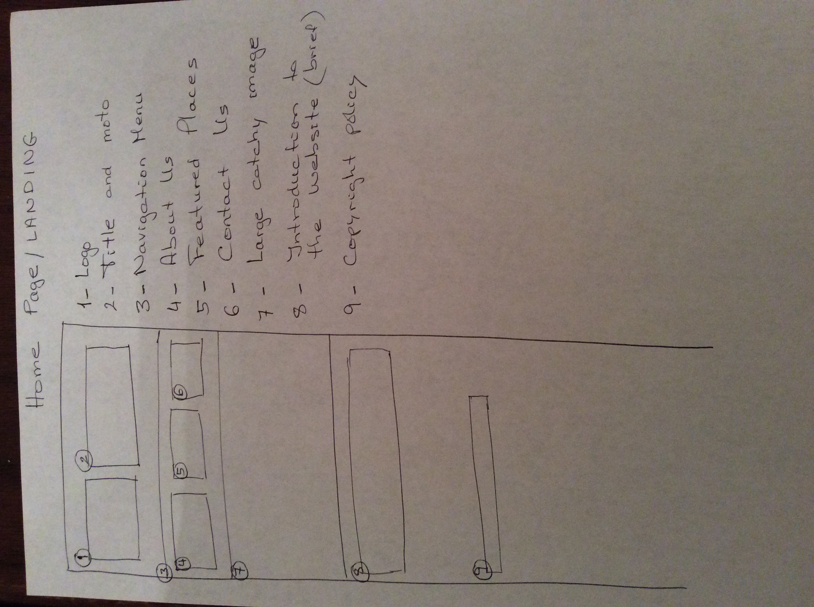
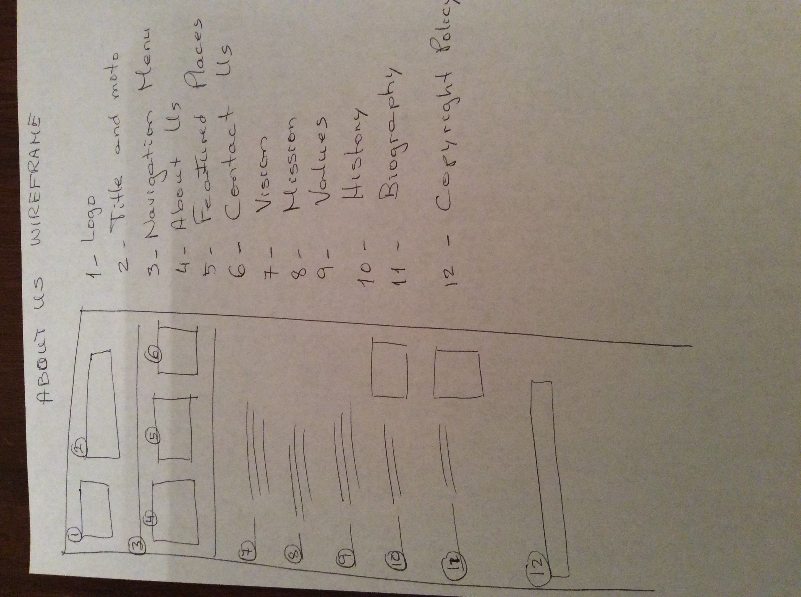
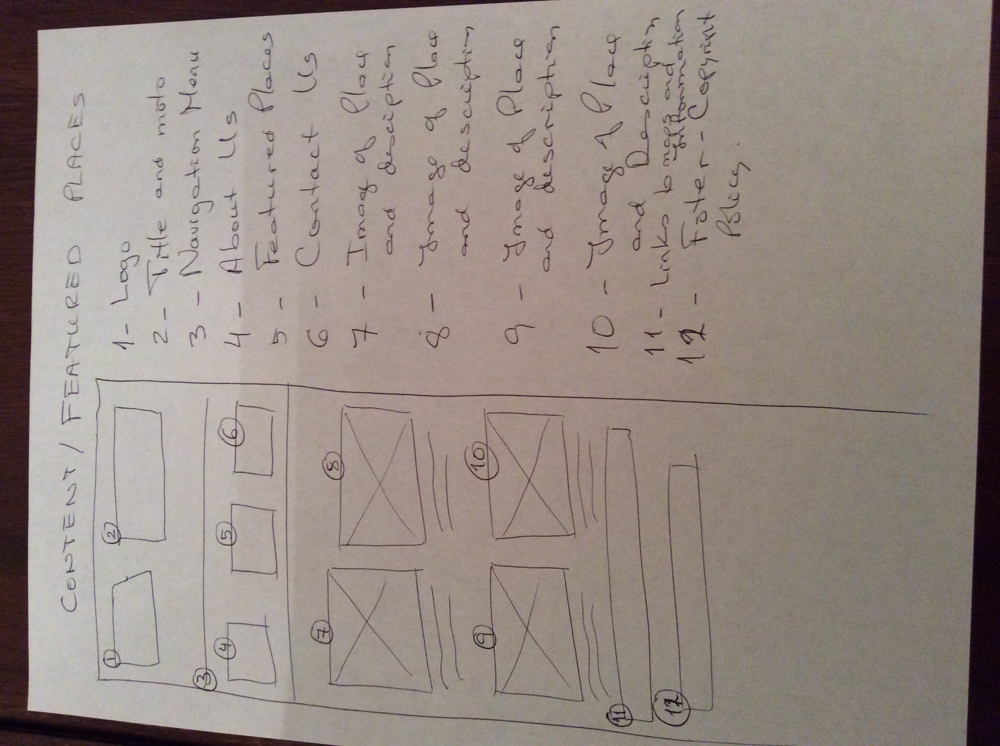
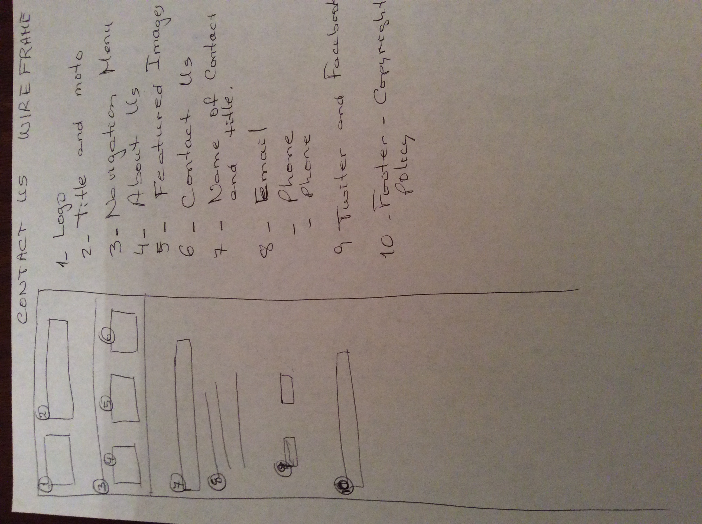

# My INF 7420 Project

I will be building a travel experience website. The purpose of this project is to share my travel experiences in a unique way to inspire viewers to connect with peoples and places of the world, and with nature

## Wireframes

I value planning and user experience so I have created wireframes to show the architecture and design of my website.

Home Page - will include header, navigation menu, catchy large image and introduction, and footer

Header - will include my logo, title of website, and navigation menu

Navigation Menu - will include links to other pages such as about us, featured places, and contact us

Footer - will include copyright information

About Us - wil include a header, navigation menu, footer. It will also include my vision, mission, values, history and my biography, footer

Featured Places - will include header, navigation menu, footer. It will also include images and descriptions of places, links to maps and other information, footer

Contact Us - will include name of contact person, title, email, phone number and social media such as twiter and facebook, footer
